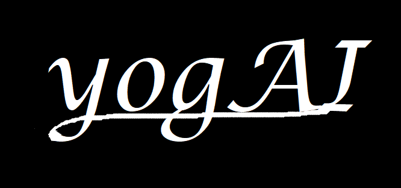

# yogAI - the ultimate yoga-guide

https://github.com/heojiNn/yogAI/assets/58489134/c26fd61f-95c6-462c-8ee5-ba41db0dc59a

------
## (I) Usage:

> git clone https://github.com/heojiNn/hcai-yogai.git

> cd flask01

Set up venv  
Install requirements/packages(mediapipe,flask,...)   
run app.py  
open localhost:5000 in browser  

------
## (II) Todos:

+ refer to TODOs in Code
+ other

------
## (III) Requirements:
* Python >= 3.9 (might work earlier but problems with mediapipe in 3.8)
* Flask, opencv/cv2, mediapipe, pandas, numpy, ... (imports)

-------
